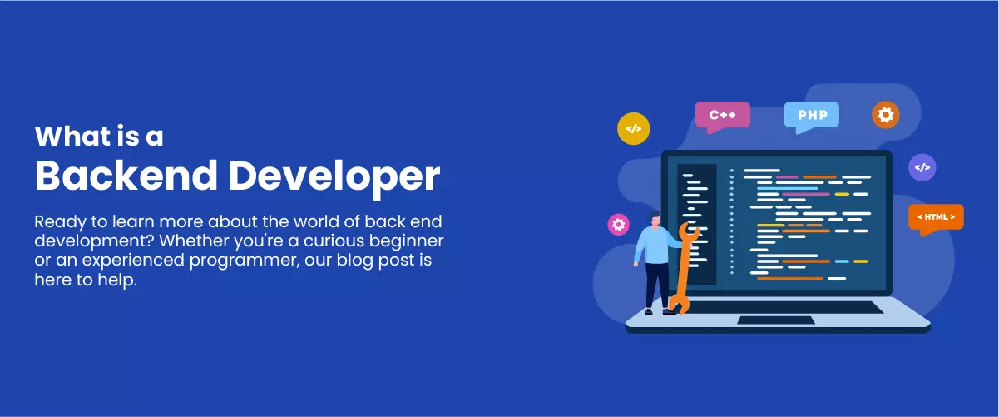

<h1> Backend Developer </h1>

<b>
   Hello my name is soran from iran 
i started django since 1 years ago and writing telegram bot since 1 years ago.
</b>

  <h2>Skill's</h2>
  <h3>Language's</h3>
  
  <h3>Framework & Library</h3>
  
  <h3>Other Skill's</h3>
  

  <h2>Social Media</h2>
  
  

